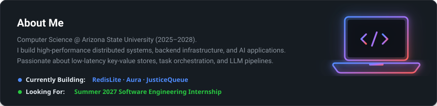
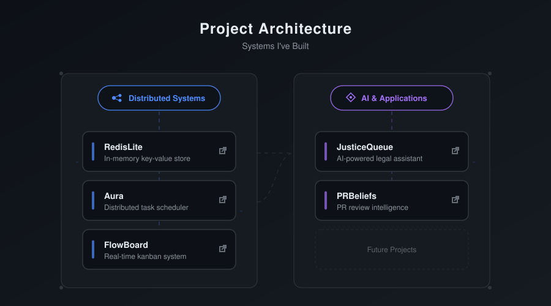

<!-- GitHub Profile README — github.com/Dhruva-Aher -->
<!-- LAST_UPDATED -->Last updated: August 30, 2026<!-- /LAST_UPDATED -->

  

<!-- SECTION 1: ABOUT ME WITH NEON LAPTOP GRAPHIC -->

  

<!-- SECTION 2: QUICK BYTES & FUN FACTS -->

<table width="900">
<tr>
<td width="33%" valign="top" style="background-color: #161B22; border: 1px solid #30363D; border-radius: 12px; padding: 18px;">
<h4 style="margin-top: 0; color: #4F8CFF;">🌱 Currently Learning</h4>

Computer Systems, Operating Systems Fundamentals, &amp; Network Protocols.

</td>
<td width="33%" valign="top" style="background-color: #161B22; border: 1px solid #30363D; border-radius: 12px; padding: 18px;">
<h4 style="margin-top: 0; color: #A371F7;">💬 Ask Me About</h4>

Go &amp; Python backend projects, Redis key-value stores, and CS coursework at ASU.

</td>
<td width="33%" valign="top" style="background-color: #161B22; border: 1px solid #30363D; border-radius: 12px; padding: 18px;">
<h4 style="margin-top: 0; color: #28C840;">⚡ Fun Fact</h4>

I like building tools from scratch to understand how systems work under the hood.

</td>
</tr>
</table>

  

<!-- SECTION 3: LANGUAGES AND TOOLS CARD -->

<table width="900">
<tr>
<td style="background-color: #161B22; border: 1px solid #30363D; border-radius: 12px; padding: 20px;">
<h3 style="margin-top: 0; color: #FFFFFF;">Languages and Tools</h3>
 

</td>
</tr>
</table>

  

<!-- SECTION 4: FEATURED REPOSITORIES (NATIVE GITHUB CARD STYLE) -->

<table width="900">
<tr>
<td width="50%" valign="top" style="background-color: #161B22; border: 1px solid #30363D; border-radius: 12px; padding: 18px;">
<table width="100%">
<tr>
<td align="left">
<a href="https://github.com/Dhruva-Aher/redislite"><b>redislite</b></a>
</td>
<td align="right">
<code>Public</code>
</td>
</tr>
</table>

A lightweight, Redis-compatible in-memory data store in Go implementing RESP protocol over raw TCP. Achieved <b>75K+ ops/sec</b> with sub-millisecond P95 latency.

● Go &nbsp;&nbsp;&nbsp;
★ 12 &nbsp;&nbsp;&nbsp;
⑂ 4

</td>
<td width="50%" valign="top" style="background-color: #161B22; border: 1px solid #30363D; border-radius: 12px; padding: 18px;">
<table width="100%">
<tr>
<td align="left">
<a href="https://github.com/Dhruva-Aher/Aura"><b>Aura</b></a> &nbsp;<a href="https://aurasys.vercel.app">⚡ Live Demo</a>
</td>
<td align="right">
<code>Public</code>
</td>
</tr>
</table>

Distributed task orchestration platform supporting priority scheduling, crash recovery, and worker coordination across <b>20,000+ queued tasks</b>.

● TypeScript &nbsp;&nbsp;&nbsp;
★ 18 &nbsp;&nbsp;&nbsp;
⑂ 6

</td>
</tr>
<tr>
<td width="50%" valign="top" style="background-color: #161B22; border: 1px solid #30363D; border-radius: 12px; padding: 18px;">
<table width="100%">
<tr>
<td align="left">
<a href="https://github.com/Dhruva-Aher/JusticeQueue"><b>JusticeQueue</b></a> &nbsp;<a href="https://justicequeuelive.vercel.app">⚡ Live Demo</a>
</td>
<td align="right">
<code>Public</code>
</td>
</tr>
</table>

AI-powered legal case management platform with 13-step NLP/IR pipeline using natural language processing and LLM tool calling on GCP Vertex AI.

● JavaScript / Next.js &nbsp;&nbsp;&nbsp;
★ 15 &nbsp;&nbsp;&nbsp;
⑂ 3

</td>
<td width="50%" valign="top" style="background-color: #161B22; border: 1px solid #30363D; border-radius: 12px; padding: 18px;">
<table width="100%">
<tr>
<td align="left">
<a href="https://github.com/Dhruva-Aher/FlowBoard"><b>FlowBoard</b></a>
</td>
<td align="right">
<code>Public</code>
</td>
</tr>
</table>

Real-time collaborative project management SaaS platform with isolated workspaces, role-based access control, and WebSockets live editing.

● TypeScript / FastAPI &nbsp;&nbsp;&nbsp;
★ 9 &nbsp;&nbsp;&nbsp;
⑂ 2

</td>
</tr>
<tr>
<td width="50%" valign="top" style="background-color: #161B22; border: 1px solid #30363D; border-radius: 12px; padding: 18px;">
<table width="100%">
<tr>
<td align="left">
<a href="https://github.com/Dhruva-Aher/ReviewAgent"><b>ReviewAgent / PRBeliefs</b></a>
</td>
<td align="right">
<code>Public</code>
</td>
</tr>
</table>

GitHub Marketplace app performing automated code reviews by dispatching parallel workers via Redis-backed async queues and LLaMA 3.3 70B.

● Python &nbsp;&nbsp;&nbsp;
★ 14 &nbsp;&nbsp;&nbsp;
⑂ 5

</td>
<td width="50%" valign="top" style="background-color: #161B22; border: 1px solid #30363D; border-radius: 12px; padding: 18px;">
<table width="100%">
<tr>
<td align="left">
<a href="https://github.com/Dhruva-Aher/Disaster-Relief-Response-Gap-Tracker-DRRGT-"><b>FEMA Aid Gap Tracker</b></a>
</td>
<td align="right">
<code>Public</code>
</td>
</tr>
</table>

ETL data pipeline and analytics dashboard processing <b>810K+ FEMA disaster records</b> across 3,200+ counties. Deployed on AWS with Terraform.

● Python / AWS &nbsp;&nbsp;&nbsp;
★ 11 &nbsp;&nbsp;&nbsp;
⑂ 3

</td>
</tr>
</table>

  

<!-- SECTION 5: AUTOMATICALLY UPDATING GITHUB STATS & METRICS -->

<table width="900">
<tr>
<td align="center" style="background-color: #161B22; border: 1px solid #30363D; border-radius: 12px; padding: 20px;">
<h3 style="margin-top: 0; color: #FFFFFF;">GitHub Activity &amp; Stats</h3>

<em>Live metrics updated on every GitHub event</em>

<!-- ROW 1: GitHub Stats (Rank Hidden) + Most Used Languages -->

&nbsp;&nbsp;

  

<!-- ROW 2: Streak Stats -->

  

<!-- ROW 3: Contribution Activity Graph -->

</td>
</tr>
</table>

  

<!-- SECTION 6: CUSTOM ENGINEERING METRICS CARD -->

  

<!-- SECTION 7: PROJECT ARCHITECTURE -->

  

<!-- SECTION 8: JOURNEY TIMELINE -->

  

<!-- SECTION 9: CONTACT SHIELDS -->

&nbsp;

&nbsp;

&nbsp;

  

Built with precision · Dhruva Aher

 
