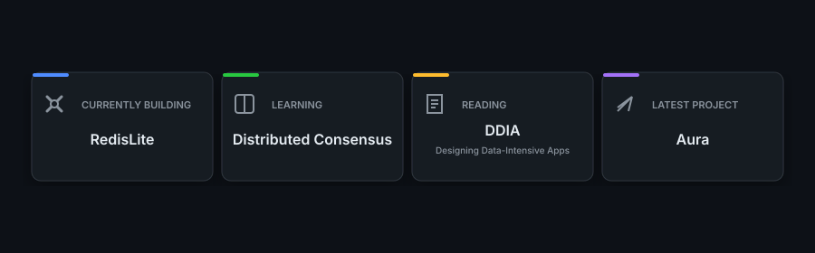

<!-- GitHub Profile README — github.com/Dhruva-Aher -->
<!-- LAST_UPDATED -->Last updated: July 25, 2026<!-- /LAST_UPDATED -->

  

   

  

   

  

   

  <h2>Featured Projects</h2>
  
<em>Selected works in distributed systems, AI platforms, and cloud infrastructure</em>

 

<table>
  <tr>
    <td width="50%" valign="top">
       
      <h3>◆ RedisLite</h3>
      
A lightweight, Redis-compatible in-memory data store in Go implementing the RESP networking protocol over raw TCP in a Unix/Linux environment. Achieved 75K+ ops/sec with sub-millisecond P95 latency across concurrent TCP clients.

      
<em>75K+ ops/sec · Sub-millisecond P95 latency · goroutines & sync.RWMutex</em>

      
<code>Go</code> <code>TCP</code> <code>RESP Protocol</code> <code>Concurrent Systems</code> <code>Linux</code>

      <a href="https://github.com/Dhruva-Aher/RedisLite">→ View Repository</a>
        
    </td>
    <td width="50%" valign="top">
       
      <h3>◆ Aura</h3>
      
A distributed task orchestration platform supporting priority scheduling, crash recovery, and Redis-backed concurrent worker coordination across 20,000+ queued tasks, sustaining 300 jobs/min at P95 latency of 6.5s.

      
<em>20,000+ queued tasks · Heartbeat crash recovery · 250 unit tests</em>

      
<code>Node.js</code> <code>PostgreSQL</code> <code>Redis</code> <code>Docker</code>

      <a href="https://github.com/Dhruva-Aher/Aura">→ View Repository</a> · <a href="https://aurasys.vercel.app">⚡ Live Demo</a>
        
    </td>
  </tr>
  <tr>
    <td width="50%" valign="top">
       
      <h3>◆ JusticeQueue</h3>
      
Designed a 13-step NLP and IR pipeline using LLM tool calling on GCP Vertex AI to analyze legal documents, retrieve semantically similar cases, and generate structured recommendations with explainable reasoning.

      
<em>13-step NLP/IR pipeline · Vertex AI Gemini Pro/Flash · text-embedding-004</em>

      
<code>Next.js 14</code> <code>GCP Vertex AI</code> <code>MongoDB Atlas</code> <code>Gemini API</code> <code>Upstash Redis</code>

      <a href="https://github.com/Dhruva-Aher/JusticeQueue">→ View Repository</a> · <a href="https://justicequeuelive.vercel.app">⚡ Live Demo</a>
        
    </td>
    <td width="50%" valign="top">
       
      <h3>◆ FlowBoard</h3>
      
Architected a multi-tenant project management SaaS platform with isolated workspaces, role-based access control, JWT authentication, and real-time collaborative editing over WebSockets.

      
<em>Multi-tenant RBAC · WebSockets real-time sync · TanStack Query & Zustand</em>

      
<code>React</code> <code>TypeScript</code> <code>FastAPI</code> <code>PostgreSQL</code> <code>Redis</code> <code>WebSockets</code>

      <a href="https://github.com/Dhruva-Aher/FlowBoard">→ View Repository</a>
        
    </td>
  </tr>
</table>

 

  <table>
    <tr>
      <td align="center" valign="top">
         
        <h3>◆ PRBeliefs</h3>
        
Built and deployed a GitHub Marketplace app performing automated code reviews via parallel workers and Redis-backed async queue; outputs structured, ranked feedback with per-installation rate limiting.

        
<em>GitHub Marketplace app · Decoupled webhook queue · Docker Compose CI/CD</em>

        
<code>Python</code> <code>Redis</code> <code>SQLite</code> <code>Docker</code> <code>GitHub Actions</code>

        <a href="https://github.com/Dhruva-Aher/PRBeliefs">→ View Repository</a>
          
      </td>
    </tr>
  </table>

   

  <h2>Technical Expertise</h2>
   

**Languages**

  

**AI, Systems & Backend**

  

**Cloud & DevOps**

  

**Frontend**

   

  <h2>Metrics</h2>
   
  
  &nbsp;&nbsp;&nbsp;
  

   

  <h2>Journey</h2>
   
  

   

  
  &nbsp;
  
  &nbsp;
  
  &nbsp;
  

   

  Built with precision · Dhruva Aher

 
