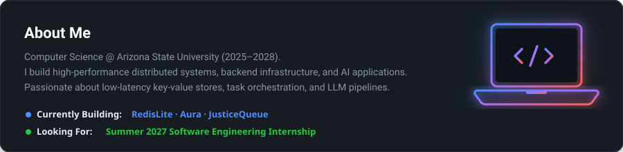
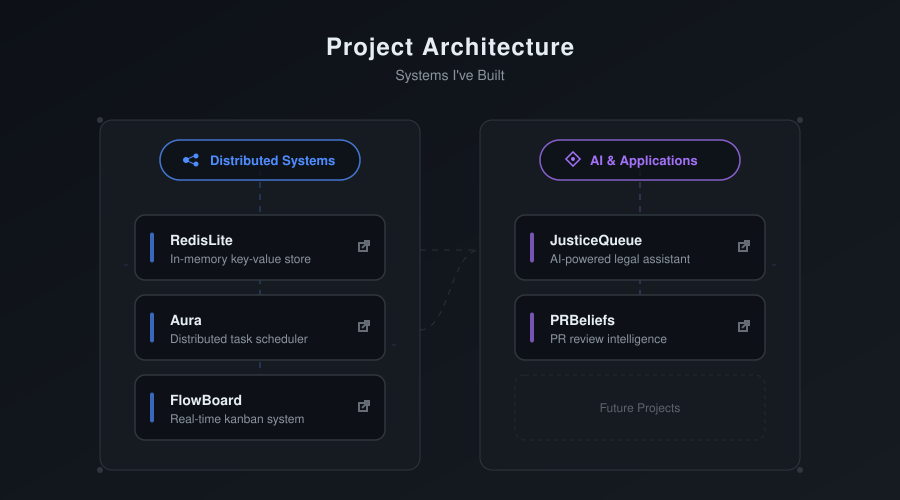

<!-- GitHub Profile README — github.com/Dhruva-Aher -->
<!-- LAST_UPDATED -->Last updated: September 30, 2026<!-- /LAST_UPDATED -->

  

<!-- SECTION 1: ABOUT ME WITH NEON LAPTOP GRAPHIC -->

  

<!-- SECTION 2: QUICK BYTES & FUN FACTS -->

<table width="900">
<tr>
<td width="33%" valign="top" style="background-color: #161B22; border: 1px solid #30363D; border-radius: 12px; padding: 18px;">
<h4 style="margin-top: 0; color: #4F8CFF;">🌱 Currently Learning</h4>

Computer Systems, Operating Systems Fundamentals, &amp; Network Protocols.

</td>
<td width="33%" valign="top" style="background-color: #161B22; border: 1px solid #30363D; border-radius: 12px; padding: 18px;">
<h4 style="margin-top: 0; color: #A371F7;">💬 Ask Me About</h4>

Go &amp; Python backend projects, Redis key-value stores, and CS coursework at ASU.

</td>
<td width="33%" valign="top" style="background-color: #161B22; border: 1px solid #30363D; border-radius: 12px; padding: 18px;">
<h4 style="margin-top: 0; color: #28C840;">⚡ Fun Fact</h4>

I like building tools from scratch to understand how systems work under the hood.

</td>
</tr>
</table>

  

<!-- SECTION 3: LANGUAGES AND TOOLS CARD -->

<table width="900">
<tr>
<td style="background-color: #161B22; border: 1px solid #30363D; border-radius: 12px; padding: 20px;">
<h3 style="margin-top: 0; color: #FFFFFF;">Languages and Tools</h3>
 

</td>
</tr>
</table>

  

<!-- SECTION 4: FEATURED REPOSITORIES (NATIVE GITHUB CARD STYLE) -->

<table width="900">
<tr>
<td width="50%" valign="top" style="background-color: #161B22; border: 1px solid #30363D; border-radius: 12px; padding: 18px;">
<table width="100%">
<tr>
<td align="left">
<a href="https://github.com/Dhruva-Aher/Aura"><b>Aura</b></a> &nbsp;<a href="https://aurasys.vercel.app">Live Demo</a>
</td>
<td align="right">
<code>Public</code>
</td>
</tr>
</table>

Distributed job queue with leases, fences, and Postgres crash recovery. Local proof: <b>303.72 jobs/min</b>, P95 queue wait <b>7.40s</b>, <b>6,000</b> jobs restored in <b>1,843 ms</b>.

● TypeScript · Redis · PostgreSQL

</td>
<td width="50%" valign="top" style="background-color: #161B22; border: 1px solid #30363D; border-radius: 12px; padding: 18px;">
<table width="100%">
<tr>
<td align="left">
<a href="https://github.com/Dhruva-Aher/FlowBoard"><b>FlowBoard</b></a> &nbsp;<a href="https://flowboard-iota-blond.vercel.app">Live Demo</a>
</td>
<td align="right">
<code>Public</code>
</td>
</tr>
</table>

Multi-tenant boards &amp; docs with fail-closed JWT/RBAC and membership-gated WebSockets (<b>403</b> / <b>4003</b>). <b>68</b> pytest cases; Vercel + Neon demo.

● FastAPI · React · PostgreSQL

</td>
</tr>
<tr>
<td width="50%" valign="top" style="background-color: #161B22; border: 1px solid #30363D; border-radius: 12px; padding: 18px;">
<table width="100%">
<tr>
<td align="left">
<a href="https://github.com/Dhruva-Aher/redislite"><b>redislite</b></a>
</td>
<td align="right">
<code>Public</code>
</td>
</tr>
</table>

Redis-compatible KV store in Go: RESP over TCP, TTL eviction, AOF. Local bench: <b>74,498 ops/sec</b>, P95 <b>0.20 ms</b> (10 clients × 1k cmds).

● Go

</td>
<td width="50%" valign="top" style="background-color: #161B22; border: 1px solid #30363D; border-radius: 12px; padding: 18px;">
<table width="100%">
<tr>
<td align="left">
<a href="https://github.com/Dhruva-Aher/UnderWrite"><b>Underwrite</b></a>
</td>
<td align="right">
<code>Public</code>
</td>
</tr>
</table>

Fail-closed ML deploy gate: DataHub lineage → deterministic CI block → governance write-back. LLM assists; never authorizes.

● TypeScript · DataHub

</td>
</tr>
<tr>
<td width="50%" valign="top" style="background-color: #161B22; border: 1px solid #30363D; border-radius: 12px; padding: 18px;">
<table width="100%">
<tr>
<td align="left">
<a href="https://github.com/Dhruva-Aher/receipts"><b>Receipts</b></a>
</td>
<td align="right">
<code>Public</code>
</td>
</tr>
</table>

Verifies coding-agent completion claims against command re-runs and git evidence before merge. Reproducible FIX receipt on weakened tests.

● Node.js

</td>
<td width="50%" valign="top" style="background-color: #161B22; border: 1px solid #30363D; border-radius: 12px; padding: 18px;">
<table width="100%">
<tr>
<td align="left">
<a href="https://github.com/Dhruva-Aher/JusticeQueue"><b>JusticeQueue</b></a> &nbsp;<a href="https://justicequeuelive.vercel.app">Live Demo</a>
</td>
<td align="right">
<code>Public</code>
</td>
</tr>
</table>

Legal triage with Gemini intake + MongoDB Atlas Vector Search. Documented audit: <b>32/60</b> cases improved with precedent retrieval.

● Next.js · MongoDB · Gemini

</td>
</tr>
<tr>
<td width="50%" valign="top" style="background-color: #161B22; border: 1px solid #30363D; border-radius: 12px; padding: 18px;">
<table width="100%">
<tr>
<td align="left">
<a href="https://github.com/Dhruva-Aher/ReviewAgent"><b>PRBeliefs</b></a>
</td>
<td align="right">
<code>Public</code>
</td>
</tr>
</table>

GitHub App that reviews PRs against team beliefs via Redis-queued multi-agent review. <b>30</b> pytest cases in CI.

● Python · FastAPI · Redis

</td>
<td width="50%" valign="top" style="background-color: #161B22; border: 1px solid #30363D; border-radius: 12px; padding: 18px;">
<table width="100%">
<tr>
<td align="left">
<a href="https://github.com/Dhruva-Aher/Disaster-Relief-Response-Gap-Tracker-DRRGT-"><b>DRRGT (FEMA gap)</b></a>
</td>
<td align="right">
<code>Public</code>
</td>
</tr>
</table>

OpenFEMA + Census ETL computing auditable <b>response gap days</b> with peer-county comparisons across ~3,200 FIPS counties.

● Python · FastAPI · PostgreSQL

</td>
</tr>
</table>

  

<!-- SECTION 5: AUTOMATICALLY UPDATING GITHUB STATS & METRICS -->

<table width="900">
<tr>
<td align="center" style="background-color: #161B22; border: 1px solid #30363D; border-radius: 12px; padding: 20px;">
<h3 style="margin-top: 0; color: #FFFFFF;">GitHub Activity &amp; Stats</h3>

<em>Live metrics updated on every GitHub event</em>

<!-- ROW 1: GitHub Stats (Rank Hidden) + Most Used Languages -->

&nbsp;&nbsp;

  

<!-- ROW 2: Streak Stats -->

  

<!-- ROW 3: Contribution Activity Graph -->

</td>
</tr>
</table>

  

<!-- SECTION 6: CUSTOM ENGINEERING METRICS CARD -->

  

<!-- SECTION 7: PROJECT ARCHITECTURE -->

  

<!-- SECTION 8: JOURNEY TIMELINE -->

  

<!-- SECTION 9: CONTACT SHIELDS -->

&nbsp;

&nbsp;

&nbsp;

  

Built with precision · Dhruva Aher

 
