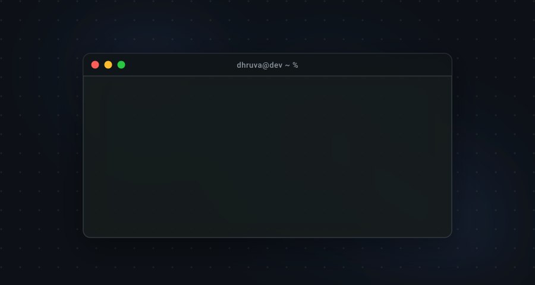
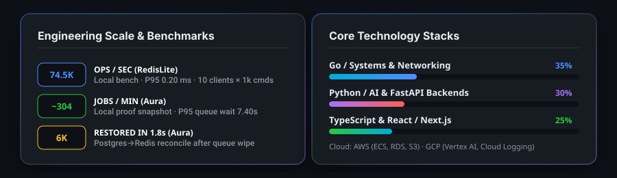

<!-- GitHub Profile README — github.com/Dhruva-Aher -->
<!-- LAST_UPDATED -->Last updated: October 01, 2026<!-- /LAST_UPDATED -->

# Dhruva Aher

**CS @ ASU** (Grand Challenges Scholars) · GPA **4.0** · Targeting **Backend / Distributed Systems / Full-stack Backend**

I build systems where failure modes are explicit: leases & crash recovery, fail-closed tenant authz, and protocol-level concurrency — with live demos and measured proof (not marketing counters).

| | |
|--|--|
| **Portfolio** | [dhruva-aher.vercel.app](https://dhruva-aher.vercel.app) |
| **Email** | [dhruvaaher48@gmail.com](mailto:dhruvaaher48@gmail.com) |
| **LinkedIn** | [linkedin.com/in/dhruva-aher](https://linkedin.com/in/dhruva-aher) |
| **Stack** | TypeScript · Go · Python · Redis · PostgreSQL · FastAPI · React · Docker |

---

## What to open first (FAANG scan)

| # | Project | Why it matters | Proof |
|---|---------|----------------|-------|
| 1 | **[Aura](https://github.com/Dhruva-Aher/Aura)** · [demo](https://aurasys.vercel.app) | Distributed job queue — leases, fences, Postgres recovery, backpressure | **303.72 jobs/min**, P95 **7.40s**, **6,000** jobs restored in **1,843 ms**, **224** tests |
| 2 | **[FlowBoard](https://github.com/Dhruva-Aher/FlowBoard)** · [demo](https://flowboard-iota-blond.vercel.app) | Multi-tenant SaaS — JWT/RBAC + WS membership fail-closed | Non-member **403** / WS **4003**, **68** pytest, live Vercel+Neon |
| 3 | **[redislite](https://github.com/Dhruva-Aher/redislite)** | From-scratch Redis subset — RESP/TCP, TTL, AOF | Local bench **78,086 ops/sec**, P95 **0.21 ms**, CI `go test` |
| 4 | **[Underwrite](https://github.com/Dhruva-Aher/UnderWrite)** | Fail-closed ML deploy gate — DataHub lineage → CI block | Deterministic authz; LLM never authorizes; sample outputs in-repo |
| 5 | **[Receipts](https://github.com/Dhruva-Aher/receipts)** | Verifies agent *claims* vs repo evidence before merge | Reproducible FIX receipt; measured e2e **~10.2s** on fixture |
| 6 | **[JusticeQueue](https://github.com/Dhruva-Aher/JusticeQueue)** · [demo](https://justicequeuelive.vercel.app) | Legal triage + Atlas Vector Search | Live stats: **7/14** improved (**50%**); top **83→98** |

**Pin order on this profile (please match):** Aura → FlowBoard → redislite → UnderWrite → Receipts → JusticeQueue

---

## Featured (same order)

<table width="100%">
<tr>
<td width="50%" valign="top">

### [Aura](https://github.com/Dhruva-Aher/Aura) · [Live](https://aurasys.vercel.app)
Distributed job queue with leases, fences, and Postgres crash recovery. Local proof: **303.72 jobs/min**, P95 queue wait **7.40s**, **6,000** jobs restored in **1,843 ms**.
 TypeScript · Redis · PostgreSQL

</td>
<td width="50%" valign="top">

### [FlowBoard](https://github.com/Dhruva-Aher/FlowBoard) · [Live](https://flowboard-iota-blond.vercel.app)
Multi-tenant boards & docs with fail-closed JWT/RBAC and membership-gated WebSockets (**403** / **4003**). **68** pytest cases; Vercel + Neon demo.
 FastAPI · React · PostgreSQL

</td>
</tr>
<tr>
<td width="50%" valign="top">

### [redislite](https://github.com/Dhruva-Aher/redislite)
Redis-compatible KV store in Go: RESP over TCP, TTL eviction, AOF. Local bench: **78,086 ops/sec**, P95 **0.21 ms**.
 Go · Systems

</td>
<td width="50%" valign="top">

### [Underwrite](https://github.com/Dhruva-Aher/UnderWrite)
Fail-closed ML deploy gate: DataHub lineage → deterministic CI block → governance write-back. LLM assists; never authorizes.
 TypeScript · DataHub · ML infra

</td>
</tr>
<tr>
<td width="50%" valign="top">

### [Receipts](https://github.com/Dhruva-Aher/receipts)
Verifies coding-agent completion claims against command re-runs and git evidence before merge.
 Node.js · Developer tools

</td>
<td width="50%" valign="top">

### [JusticeQueue](https://github.com/Dhruva-Aher/JusticeQueue) · [Live](https://justicequeuelive.vercel.app)
Legal triage with Gemini + MongoDB Atlas Vector Search. Live stats: **7/14** cases improved (**50%**); top **83→98** with precedent retrieval.
 Next.js · MongoDB · Gemini

</td>
</tr>
</table>

Also: [PRBeliefs](https://github.com/Dhruva-Aher/ReviewAgent) (GitHub App + beliefs memory, **30** tests) · [DRRGT](https://github.com/Dhruva-Aher/Disaster-Relief-Response-Gap-Tracker-DRRGT-) (FEMA+Census response-gap ETL)

---

## How I want to be read

- **Demo ≠ proof.** Aura scale numbers are from a **local** high-volume run; the public URL is for UI walkthrough. FlowBoard Redis pub/sub is proven under Compose/pytest; the Vercel demo uses NullRedis.
- **Every public number** maps to a README claim table / screenshot / test suite — ask me for the evidence path in interview.
- I optimize for **reliability and correctness stories** FAANG interviewers dig into (leases, fences, tenant gates, fail-closed policy), not vanity traffic metrics.

---

Optional graphics & activity (below the fold)

 

 

 

 

&nbsp;

&nbsp;

